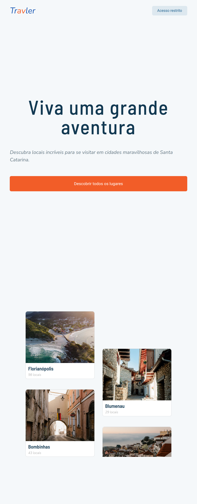
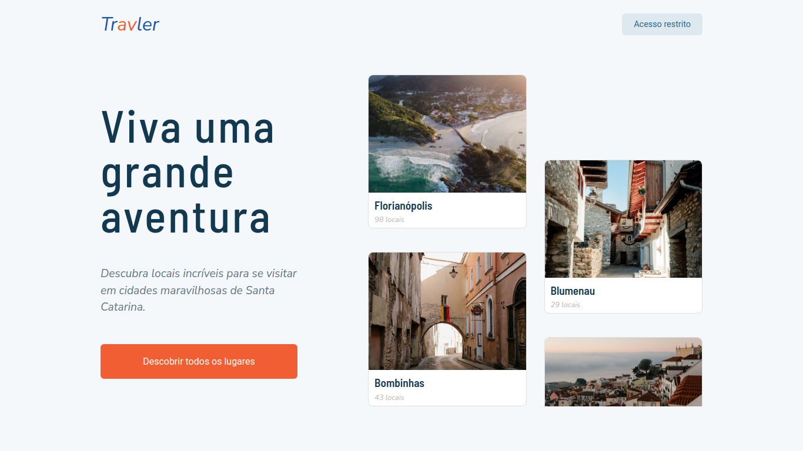
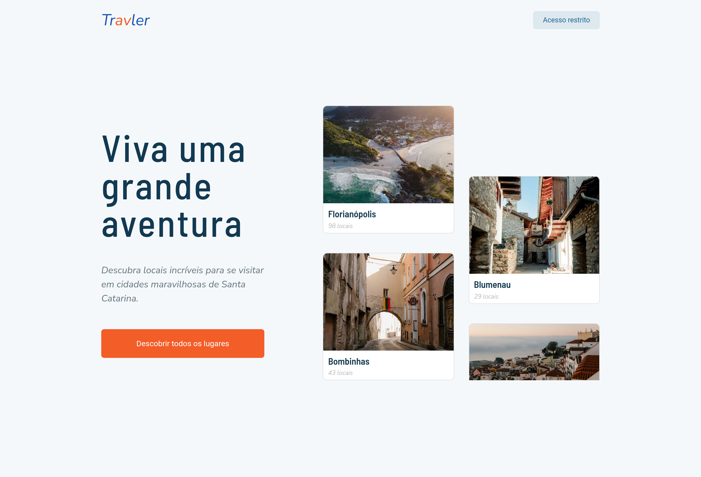

Olá, tudo bem?

Fico agradecido e feliz por você está por aqui vendo um dos meus projetos.

# Sobre o projeto

Esse é um pequeno projeto para praticar e aperfeiçoar minhas skills como desenvolvedor Front End.

Neste projeto eu estou utilizando apenas: HTML, CSS.

Eu também prático um pouco de design responsivo com a utlização de breakpoints, GRID e Flexbox.

Segue abaixo alguns screenshots:

## Contato

E-mail: carlos.contato00@gmail.com

Website: [https://carloseduardo.dev](https://carloseduardo.dev)

Atenciosamente,

Cadu.